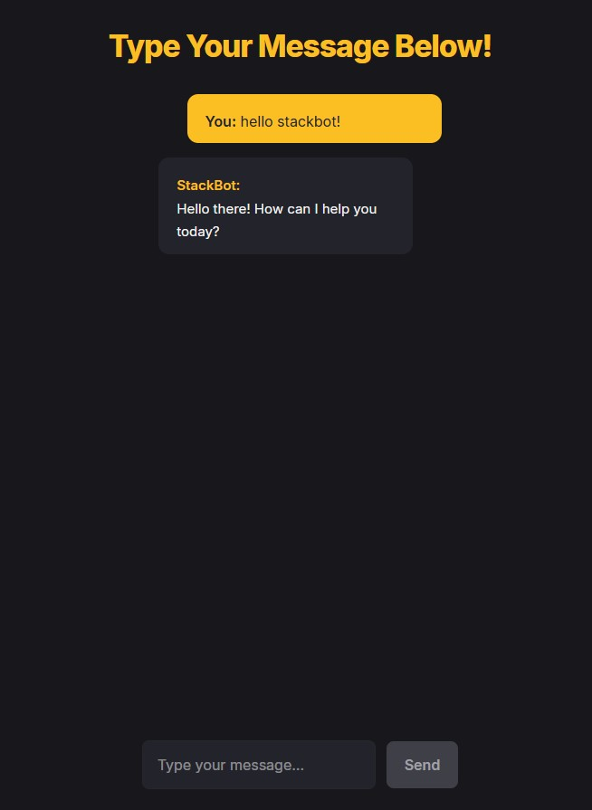

# 🤖 StackBot-AI

[](https://opensource.org/licenses/MIT)


---

## 📸 Preview



---

## 🧠 Features

- 🔁 Multi-conversation support (create, delete, switch)
- 🤖 AI-powered Q&A with Gemini or OpenAI
- 🧼 Clean UI with dark mode and animations
- 💬 Markdown rendering for responses
- ⚡ Real-time frontend-backend sync

---

## 🧠 OpenAI/Gemini API Usage

StackBot-AI integrates either **OpenAI** or **Google Gemini** to process user input and return smart answers.

### 🔌 Supported APIs

- **OpenAI GPT-3.5 / GPT-4**
- **Gemini Pro (via `@google/generative-ai`)**

### 📦 Sample Integration

```js
const { GoogleGenerativeAI } = require('@google/generative-ai');
const genAI = new GoogleGenerativeAI(process.env.GEMINI_API_KEY);
const model = genAI.getGenerativeModel({ model: 'gemini-pro' });

const result = await model.generateContent(userInput);
const aiMessage = (await result.response).text();
```
---

## 📁 Application Architecture
### Frontend Components
- App.jsx: Manages layout and global settings
- ChatPage.jsx: Controls logic, state, and API interaction
- Sidebar.jsx: Renders conversation list and handlers
- ChatList.jsx: Displays messages with framer-motion + markdown
- ChatInput.jsx: Input form connected to backend

### Backend
- Express + Node.js
- RESTful API for /api/conversations and /api/messages

### Modular routing
- .env config with API keys
- MongoDB/Mongoose integration

## 🔄 Workflow Summary
- App loads → ChatPage fetches conversations
- User selects/creates a chat → messages fetched
- User sends a message → POST to backend
- Backend processes input via Gemini/OpenAI → returns response
- UI re-renders with new messages

## 🚀 Getting Started
### Requirements
- Node.js v18+
- npm
- MongoDB (Atlas/local)
### Install & Run
```bash
git clone https://github.com/Adytia855/StackBot-AI.git
cd StackBot-AI
npm install

# Create and edit .env
cp .env.example .env

# Start development server
node server.js
```

---

## 💡 Tech Stack
- Frontend: React, Tailwind CSS, framer-motion, React Markdown
- Backend: Express, MongoDB, dotenv
- AI Integration: Google Gemini, OpenAI
- Dev Tools: ESLint, nodemon, GitHub

  
## 🤝 Contributing
Pull requests, feedback, and ideas are always welcome!
To contribute:
```bash
# Fork the repo and clone locally
# Create your feature branch
git checkout -b feature/amazing-feature
# Commit changes
git commit -m "Add amazing feature"
# Push and submit PR
```
---

🙏 Acknowledgements
- OpenAI
- Google AI Studio
- ReactJS
- MongoDB

